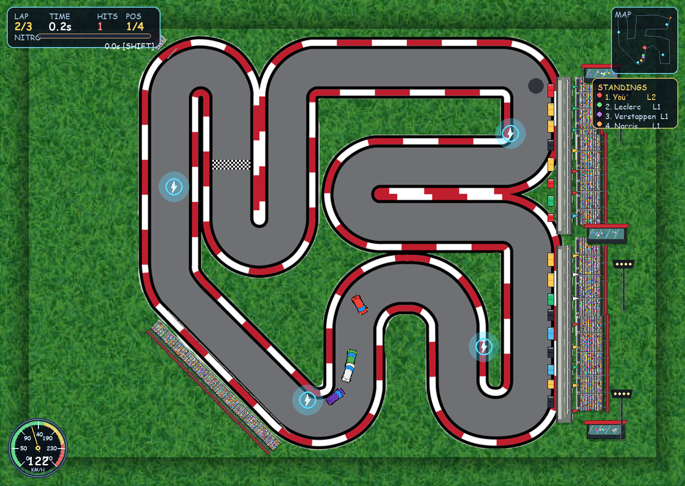
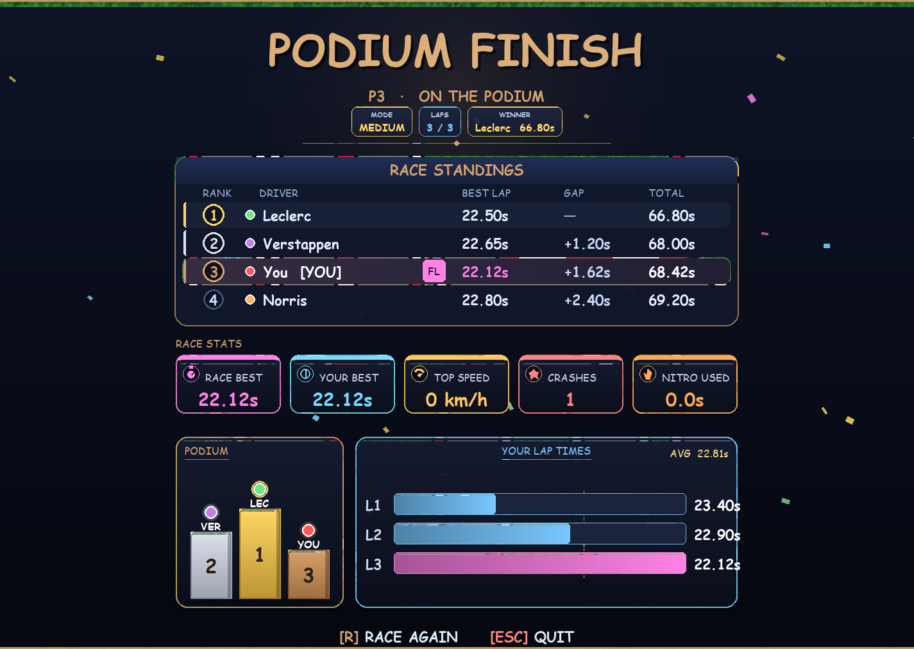

# Project description — Formula 67

Course (**Computer Programming II**, Software and Knowledge Engineering, Kasetsart University): top-down arcade racer with CSV telemetry and matplotlib charts. Stack: Python 3, pygame, matplotlib, pandas.

---

## 1. Project overview

- **Project name:** Formula 67  

- **Brief description:** You drive three laps on one track, fight three AI cars, dodge cones and oil, and pick up nitro. The game is 2D (pygame): grass, road sprite, border mask for grass collision, finish mask for laps. Everything interesting from a data angle is logged automatically. `StatsLogger` in `stats.py` writes UTF-8 CSVs under `stats/` (speed samples, steering taps, lap rows, collision events, nitro bursts, race summary, AI `competitor` rows). After a session I can run `python visualize.py` to refresh `reports/telemetry_report.png`—one big figure with tables plus line, histogram, scatter, and pie charts built from those CSVs.

- **Problem statement:** A race game without logs is hard to grade and hard to improve. I wanted a small **motorsports-style loop**: play → data on disk → plots you can actually read, not just a fastest-lap number.

- **Target users:** Instructor/ta for marking; anyone who wants to see whether they brake too much or spam one steering direction.

- **Key features:**
  - 3-lap rule, F1-style lights, HUD (lap, time, hits, position, nitro bar, minimap, km/h gauge), results + podium screen  
  - Easy / Medium / Hard: more obstacles, AI tuned a bit differently  
  - Player nitro (Shift) + pads on track  
  - Leaderboard file `leaderboard.csv` (top 10 laps)  
  - Data pipeline: `stats/*.csv` → `visualize.py` → `reports/`  
  - In-game telemetry viewer (`EmbeddedTelemetryViewer` in `visualize.py`) can be opened from the menu with **V** after telemetry exists  

- **Screenshots:**  
  Gameplay and data screenshots are included in the repository:

  
  
  

  Individual data visualization crops and explanations are listed in [screenshots/visualization/VISUALIZATION.md](screenshots/visualization/VISUALIZATION.md).

- **Original proposal (PDF):** [docs/PROJECT_PROPOSAL.pdf](docs/PROJECT_PROPOSAL.pdf)  

- **UML class diagram (PDF):** [docs/UML_Class_Diagram.pdf](docs/UML_Class_Diagram.pdf)  

- **Video (~7 minutes, public or unlisted):** Must show (1) game + stats UI, (2) how the classes fit together, (3) what each chart/table means. **Replace the line below with your real link before submission.**

  **YouTube:** [PRESENTATION — paste full URL here](https://youtu.be/)

---

## 2. Concept

### 2.1 Background

I like old top-down racers and F1 timing screens. This project was a good size for one semester: enough OOP to be real, enough data work to matter. Logging CSV during play felt more honest than inventing numbers by hand.

### 2.2 Objectives

- Ship a **playable** 3-lap mode with AI and difficulty.  
- Keep domain logic in **classes** (car, track, race, obstacles, stats, AI), not scattered magic in one file.  
- Log **five+ features** with many rows after several races (or `seed_data.py` if I need bulk).  
- One **report figure** that proves the stats are used (tables + several chart types).  
- Repo that passes our submission checklist: this file, README, LICENSE, attribution, screenshots folder, PDFs.

---

## 3. UML class diagram

Relationships and main methods are in the PDF (easier to read than a giant diagram in Markdown):

**[docs/UML_Class_Diagram.pdf](docs/UML_Class_Diagram.pdf)**

Core story: `PlayerCar` **extends** `Car`; the main loop **owns** `Track`, `RaceManager`, `StatsLogger`, lists of `Obstacle` / `NitroPad`, and `AIRacer` instances.

---

## 4. Object-oriented programming implementation

| Class | File | What it does |
|--------|------|----------------|
| **Car** | `car.py` | Position, speed, rotate, drive, friction, mask collision vs track/finish, draw + shadow. |
| **PlayerCar** | `car.py` | Nitro tank + shift boost, wall slide helper, start grid position. |
| **Track** | `track.py` | Blit road/finish/border; `is_out_of_bounds`, `at_finish_line`; path/checkpoints. |
| **RaceManager** | `race.py` | Lap count, timers, finish flag, collision + steering counters, nitro burst timing for logs, `race_summary()`. |
| **Obstacle** | `obstacle.py` | Cone / barrel / oil; rectangle hit; first-frame hit only; slows or spins car. |
| **NitroPad** | `obstacle.py` | Refill nitro; cooldown between grabs. |
| **AIRacer** | `ai_racer.py` | Follows `PATH` with lookahead steering; finishes with time for standings. |
| **StatsLogger** | `stats.py` | Buffers rows, samples speed on an interval, exports everything to `stats/*.csv`. |
| **Leaderboard** | `stats.py` | Keeps 10 best laps in `leaderboard.csv`. |
| **EmbeddedTelemetryViewer** | `visualize.py` | Scroll/zoom PNG report inside pygame when used. |

Menu / HUD / results live in `screen_menu.py`, `screen_results.py`, `hud.py`, `race_intro.py`; glue in `world.py` and `main.py`. **Settings / assets:** `settings.py`, `assets.py`. **Standings math:** `standings.py`.

---

## 5. Statistical data

### 5.1 Data recording method

While racing, the logger fills dict lists in memory. Speed gets a new row about every **0.2 s** (`SAMPLE_INTERVAL`). Steering, walls, obstacles, and nitro are **event** rows. When the race ends, `main.py` calls export; files land in `stats/`. `visualize.py` reads them with pandas, aggregates, and draws the PNG.

### 5.2 Data features

| Feature | CSV / fields | Why it’s useful |
|---------|----------------|------------------|
| Speed | `speed.csv` (`speed_px_s`, `timestamp`, `race_id`) | Line + histogram; see unstable pace |
| Steering | `steering_event.csv`, `steering.csv` | Left vs right habit |
| Lap time | `lap_time.csv` | Best lap, consistency |
| Collision | `collision_event.csv`, `collision.csv` | Mistakes vs difficulty |
| Nitro | `nitro_event.csv`, `nitro.csv` | Boost length vs speed |

After **enough races**, each stream has **100+ rows** (course expectation). `seed_data.py` can synthesize extra races if the folder was empty.

---

## 6. Changed proposed features (optional)

Compared to the early proposal, some **UI polish** and the exact matplotlib layout changed; the **AI path follower** got tuned so opponents don’t get stuck. Core deliverables stayed: 3 laps, CSV logging, multi-chart report. Nothing was removed that the rubric asked for.

---

## 7. External sources

- **Code libraries:** [pygame](https://www.pygame.org/), [matplotlib](https://matplotlib.org/), [pandas](https://pandas.pydata.org/) — versions in `requirements.txt`.  
- **Sprites / textures:** [ATTRIBUTION.md](ATTRIBUTION.md) (AI car art + reference links for track/grass).  
- **License for this repo:** [LICENSE](LICENSE) (MIT).

---

## Author & run

**Piyapong Ausawarachan** — run from repo root: `python main.py` (details: [README.md](README.md)).
