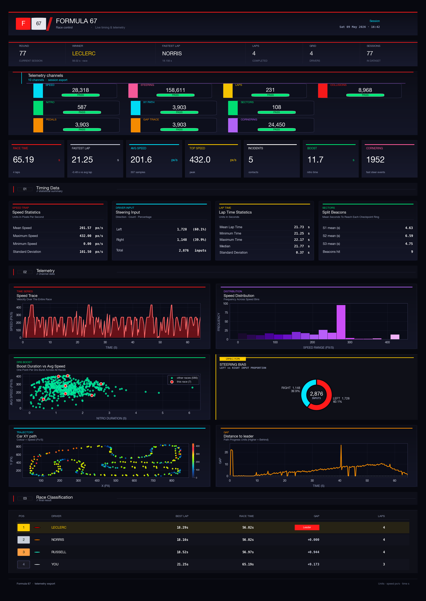
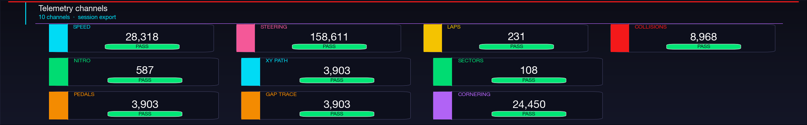
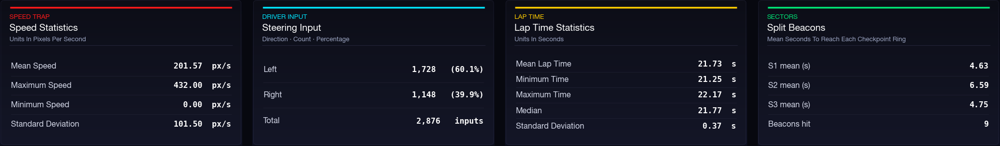
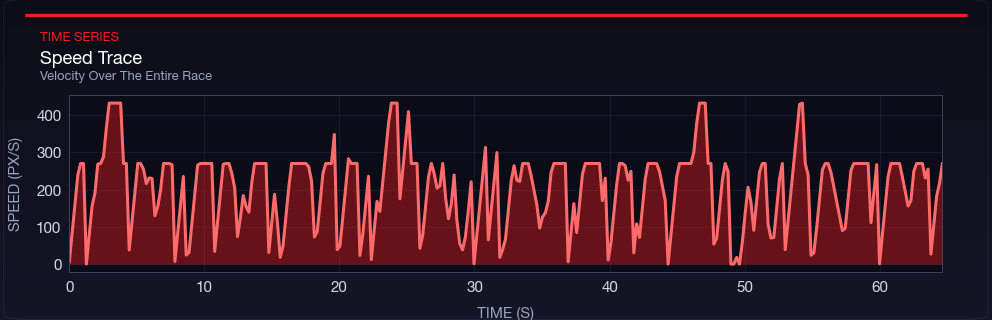
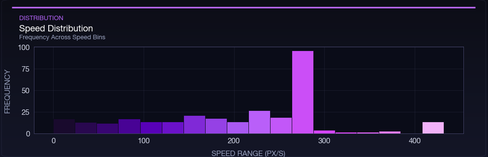
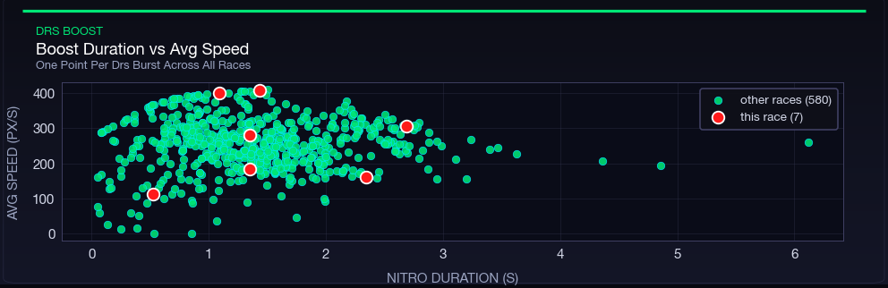
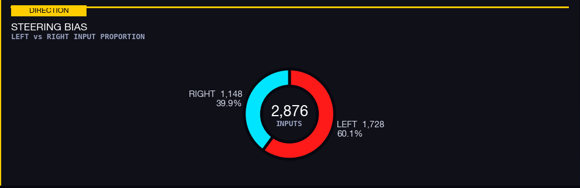
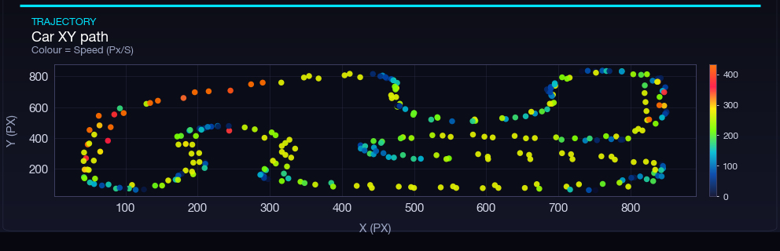
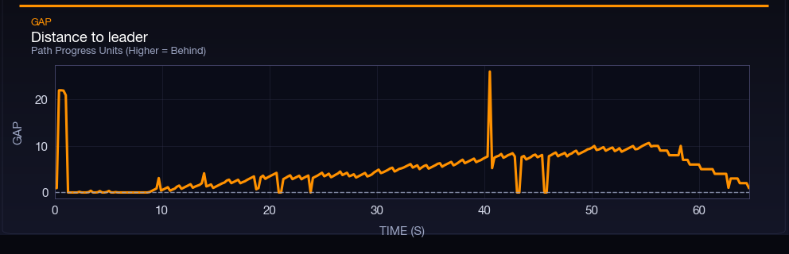
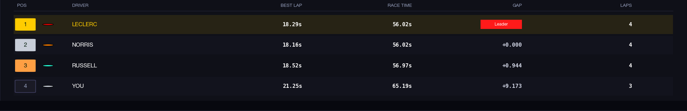

# Visualization screenshots

These screenshots document the data component of Formula 67. The source data is written to `stats/*.csv` while the game runs, then `visualize.py` reads those CSV files and exports `reports/telemetry_report.png`.

## 1. Full telemetry report



This is the complete generated report page. It combines session summary cards, telemetry health checks, statistical tables, charts, and final race classification so the data can be reviewed in one place.

## 2. Telemetry channel overview



The channel overview checks whether each telemetry stream has enough rows for analysis. Speed, steering, lap, collision, nitro, position, sector, input, gap, and cornering channels are validated here.

## 3. Timing tables



The timing tables summarize important numeric values such as speed statistics, steering input totals, lap time statistics, and sector split timing. These tables make the raw CSV files readable without opening them manually.

## 4. Speed trace



The speed trace plots speed over race time. Straights create peaks, braking zones create dips, and collisions or grass contact show up as sudden drops.

## 5. Speed distribution



The histogram shows how often the player drove within each speed range. A tighter distribution means steadier pace, while a wide distribution suggests more braking, recovery, or inconsistent driving.

## 6. Boost scatter



This scatter plot compares nitro burst duration with average speed. It helps show whether boost is being used effectively on faster sections of the circuit.

## 7. Steering bias



The steering chart compares left and right input counts. This is useful for checking driving habits and whether one direction is being over-corrected.

## 8. Car XY path



The XY path chart maps sampled player positions around the circuit and colors them by speed. It shows the driven racing line and highlights where the car slows down.

## 9. Gap trace



The gap trace records progress difference to the race leader. Higher values mean the player is behind; drops show recovery or closing the gap.

## 10. Race classification



The final classification table lists finishing order, best lap, race time, gap, and completed laps. This connects the telemetry summary back to the game result.

## Refreshing the report

From the repository root:

```sh
pip install -r requirements.txt
python visualize.py
```

The generated full report is saved to `reports/telemetry_report.png`.
